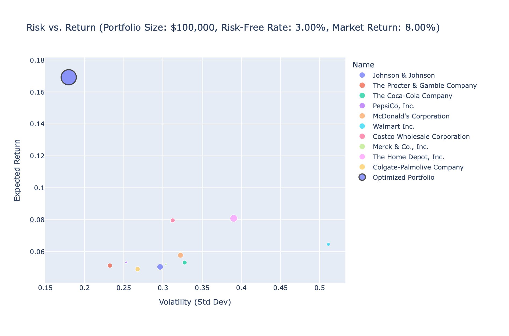

# Portfolio Optimizer

A Python-based portfolio analytics tool that applies Modern Portfolio Theory to construct and visualize optimal portfolios using real-time data from Yahoo Finance. It calculates risk-adjusted metrics like the Sharpe ratio and compares your optimized portfolio to SPY.


## Overview

This application allows users to:

* Input multiple stock tickers
* Calculate performance metrics for each asset:

  * Daily returns
  * Annualized return and standard deviation
  * Beta (vs. S\&P 500)
  * Sharpe ratio (based on a user-defined risk-free rate)
* Simulate thousands of random portfolio weight combinations to:

  * Maximize the Sharpe ratio
  * Identify optimal weights
  * Compare portfolio performance against SPY
* Visualize results via interactive Plotly charts:

  * **Risk vs. Return plot** — highlighting each asset and the optimized portfolio
  * **Portfolio vs. SPY performance** — showing relative growth over time
* Export results to auto-generated HTML reports

> **Note:** This tool calculates "expected return" based on historical data (e.g., CAPM estimates or annualized past performance). It does **not predict** future returns or incorporate forward-looking factors like valuation, analyst forecasts, or macroeconomic trends. Users should interpret results as **analytical outputs**, not investment advice or forecasts.

## Usage

1. Clone the repository or download the source code.

2. Open the `Portfolio_Optimizer.py` file and run the script:

   ```bash
   python Portfolio_Optimizer.py
   ```

3. When prompted:

   * Enter one or more stock tickers (e.g., `AMZN MSFT TSLA`)
   * Specify your total initial investment (e.g., `100000`)
   * Enter your expected market return (e.g., `0.08` for 8%)
   * Enter your risk-free rate (e.g., `0.03` for 3%)

4. After collecting inputs, the script will:

   * Fetch historical data for each ticker from Yahoo Finance
   * Calculate daily returns, annualized return and volatility, beta, and Sharpe ratio
   * Run thousands of portfolio simulations to maximize the Sharpe ratio
   * Identify the optimal weights and allocations for your portfolio
   * Compare its performance to SPY
   * Display a terminal summary with expected return, risk, Sharpe ratio, weights, and dollar allocations
   * Generate and automatically open two interactive HTML charts in your default browser:

     * `risk_return_report.html`
     * `portfolio_vs_spy_report.html`

## Example Run

Suppose you want to analyze a diversified, defensive portfolio of 10 blue-chip U.S. stocks with an initial investment of **\$100,000**, assuming an expected market return of **8%** and a risk-free rate of **3%**.

**Tickers:**

```
JNJ  PG  KO  PEP  MCD  WMT  COST  MRK  HD  CL
```

**Inputs:**

```
Initial Investment: 100000
Expected Market Return: 0.08
Risk-Free Rate: 0.03
```

**Output Example:**

```
Optimal Portfolio Allocation (Max Sharpe Ratio):

   JNJ                      → 11.53%
   PG                       → 10.22%
   KO                       → 9.85%
   PEP                      → 9.94%
   MCD                      → 10.11%
   WMT                      → 11.02%
   COST                     → 10.41%
   MRK                      → 9.61%
   HD                       → 9.84%
   CL                       → 7.47%

   Expected Annual Return  : 17.06%
   Portfolio Std Dev       : 14.29%
   Sharpe Ratio            : 0.98
```

## Screenshots

### Risk vs Return Plot

Displays the expected return, volatility, and Sharpe ratio of each asset. The optimized portfolio is highlighted.



### Portfolio vs SPY

Compares the growth of the optimized portfolio over time against the SPY benchmark.


### Terminal Output

Summarized metrics for each asset including expected return, volatility, Sharpe ratio, and allocation.


## Dependencies

This project uses the following Python libraries:

* [`yfinance`](https://pypi.org/project/yfinance/) – for retrieving stock and ETF data
* [`pandas`](https://pypi.org/project/pandas/) – for data handling and manipulation
* [`numpy`](https://pypi.org/project/numpy/) – for numerical operations and portfolio math
* [`plotly`](https://pypi.org/project/plotly/) – for interactive data visualizations
* [`re`](https://docs.python.org/3/library/re.html) – for parsing ticker symbols from user input
* [`os`](https://docs.python.org/3/library/os.html) – for launching HTML reports in the browser

## License

This project is licensed under the MIT License. See the `LICENSE` file for details.
